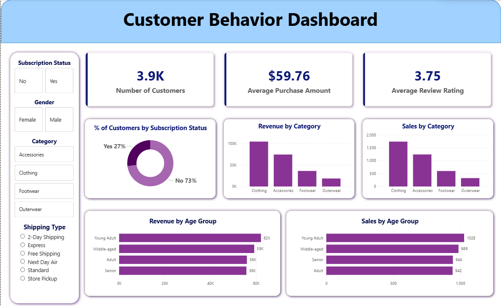

# customer_behavior_analysis
End-to-end analysis of customer behavior patterns using Python and SQL to drive data-informed business decisions. Visualized in Power BI.

# Customer Shopping Behavior Analysis 📊

## 📌 Project Overview

This project provides an end-to-end data analytics solution to understand customer purchasing patterns. It involves data cleaning and feature engineering in **Python**, structured storage and complex querying in **PostgreSQL**, interactive visualization in **Power BI**, and a professional project summary created via **Gamma**.

The goal is to identify high-value customer segments, analyze subscription trends, and provide actionable business insights regarding spending behavior across different demographics.

## 📁 Dataset Information

The project utilizes a **Customer Shopping Behavior Dataset** (3,900 records).

* **Key Features:** Customer ID, Age, Gender, Purchase Amount, Category, Subscription Status, Shipping Type, and Review Ratings.
* **Target Segments:** Subscribers vs. Non-Subscribers, Age Groups (Seniors, Adults, Middle-aged, Young Adults).

## 🛠️ Tech Stack & Tools

* **Data Processing:** Python (Pandas, SQLAlchemy)
* **Database:** PostgreSQL (pgAdmin 4)
* **Visualization:** Power BI Desktop
* **Documentation:** Notion
* **Presentation:** Gamma AI (PPT) & GitHub

## 🚀 Execution Steps

### 1. Data Cleaning & ETL (Python)

* Performed Exploratory Data Analysis (EDA) using `pandas`.
* Created new features such as `age_group` using `pd.qcut` for balanced distribution.
* Automated the data export from a Jupyter Notebook to a **PostgreSQL** database using `sqlalchemy`.

### 2. Database Management (SQL)

* Designed a relational schema to store 3,900 rows of cleaned data.
* Wrote complex SQL queries involving:
* **CTEs (Common Table Expressions):** For customer segmentation (New, Returning, Loyal).
* **Window Functions (`ROW_NUMBER`):** To identify the top 3 most purchased products per category.
* **Aggregations:** To compare revenue and average spend across genders and subscription statuses.

### 3. Data Visualization (Power BI)

* Connected Power BI to the local PostgreSQL server.
* Developed a 1500px wide professional dashboard featuring:
* **KPI Cards:** Total Revenue, Avg Purchase, and Total Customers.
* **Donut Charts:** Subscription adoption rates.
* **Clustered Bar Charts:** Sales distribution by Category and Age Group.
* **Interactive Slicers:** Filtering by Gender, Category, and Shipping Type.

### 4. Reporting & Presentation

* Compiled a technical project report in **Notion**.
* Generated an AI-enhanced presentation using **Gamma** to summarize key business findings for stakeholders.

## 📊 Dashboard Preview

*The dashboard features a clean, modern UI with a focus on cross-filtering and high-level KPIs.*

## 💡 Key Results & Insights

* **Subscription Gap:** 100% of current subscribers (1,053) are Male, identifying a massive untapped market for Female-targeted subscription plans.
* **Top Category:** "Clothing" is the highest revenue-generating category across all age groups.
* **Demographic Lead:** "Young Adults" represent the largest customer volume and highest total spend.
* **Engagement:** The average review rating is 3.75, suggesting room for improvement in customer satisfaction.

## 🛠️ How to Run

1. **Database Setup:** Run the provided `.sql` script in pgAdmin to create the `customer` table.
2. **Python Environment:** Install dependencies (`pip install pandas sqlalchemy psycopg2`) and run the `Customer_Shopping_Behavior_Analysis.ipynb` notebook.
3. **Power BI:** Open the `.pbix` file. If prompted, update the Data Source Settings to point to your local PostgreSQL server.
4. **Queries:** Use `customer_analysis_queries.sql` to replicate the statistical findings.

---

**Author:** Harsh Jain
**Email:** itsharshjainj@gmail.com
**Portfolio:** www.linkedin.com/in/itsharshjainj
